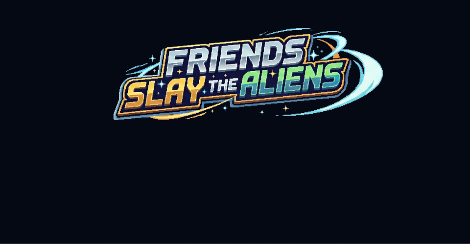

# Friends Slay the Aliens

A relentless side-scrolling brawler set on a red planet where you punch, hammer, and laser-blast waves of increasingly angry aliens back to whatever void they crawled out of.

---

## What even is this?

You've landed on a planet that clearly does not want you here. Aliens are marching your way — short ones, tall ones, ones that look like they have PhDs in being a nuisance. You walk. You jump. You **grab weapons off the ground** — a pistol that zaps across the screen, a hammer that rattles the earth, a sword that cuts clean and fast — and you keep moving right until you can't anymore.

Block incoming fire. Pick up the hearts. Watch your HP bar. Don't get cornered.

The planet goes on forever. There is no ending. There is only score.

## Go play

**[Friends Slay the Aliens!](https://aliens.friendsslay.com/)**

No download. No install. Works on desktop, controller, and mobile.

---

*Sprites built with [Pixel Lab](https://www.pixellab.ai/) · Music built with [Gemini](https://gemini.google.com/)*  
*Built with HTML5 Canvas · Web Audio API · No framework · No dependencies*
